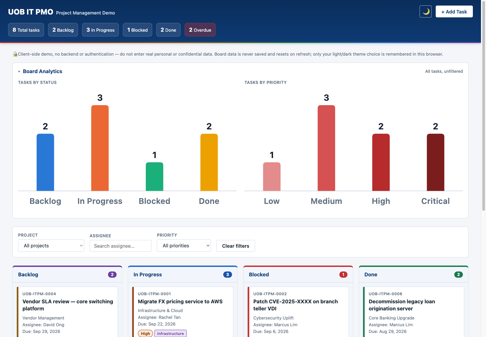

# IT Project Management Kanban Board

A single-page IT Project Management demo/training tool for UOB's internal IT PMO: a Kanban board (Backlog / In Progress / Blocked / Done) with drag-and-drop, an Add Task modal, filtering, a Board Analytics panel with accessible bar charts, a light/dark theme toggle, and email notifications via FormSubmit.

This is a demo tool, not a real UOB system — it uses a neutral "UOB IT PMO" text wordmark, no real UOB branding. The dashboard chrome stays neutral/corporate-blue for readability; a validated rainbow accent system layers on top for Kanban columns, task priority, and category tags.

**Live demo:** https://ianleonardo.github.io/WSQ-itprojmanagement/



## Running it

There is no build step, dev server, or package manager. The entire app is one file:

```
open index.html
```

(or double-click it in Finder / drag into a browser). Any change to `index.html` is live on the next page load — just refresh.

There are no tests, linters, or CI configured in this repo.

## Architecture

Everything — markup, CSS, and JS — lives in `index.html`: a `<style>` block, the DOM skeleton (header, filter bar, board, Add Task modal, toast region), and a `<script>` block. There is no framework, no build tooling, and no backend — the only network call is to FormSubmit for new-task email notifications.

- Vanilla HTML/CSS/JS only — no frameworks, no bundler, no npm packages.
- Board state (tasks, filters) lives only in memory and resets on refresh — this is intentional. The one exception is the light/dark theme choice, stored under a single scoped `localStorage` key.
- No external resources — no CDN scripts, no Google Fonts, no image files. Icons are Unicode glyphs or the system font stack.
- A `Content-Security-Policy` and referrer-policy meta tag scope the page to itself plus the FormSubmit endpoint.
- Two inline-SVG bar charts (task counts by status and by priority) use a colorblind-safe, contrast-validated palette, each bar directly labeled and with a hover/keyboard-accessible tooltip.

See [CLAUDE.md](CLAUDE.md) for full implementation details, including the rainbow accent palette and the contrast/CVD checks behind it.
